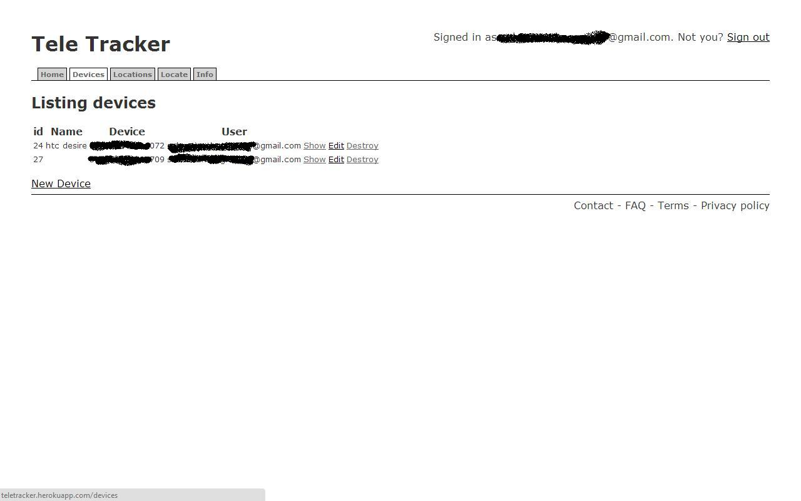
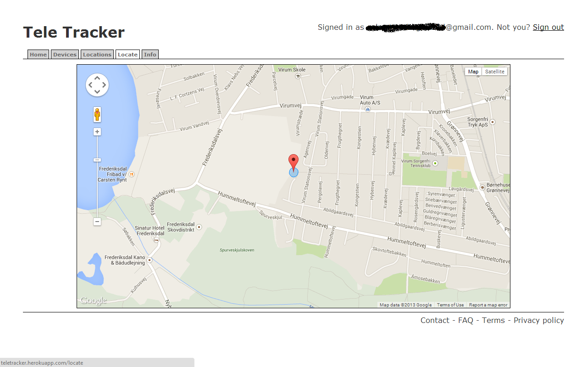
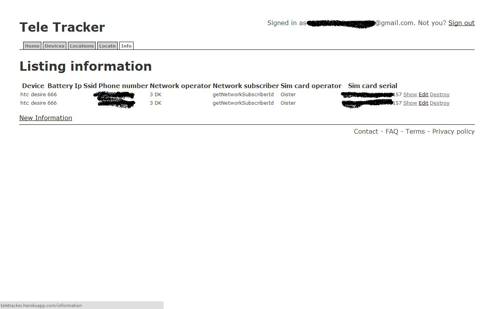

# Portfolio
The following is a small list of projects I developed.

===============
### Teletracker

People loose their phones all the time. Often by theft.

Imagine if each time a phone was sold the the buyer would pay an extra $5 - $10 for the sales rep to install a piece of tracking software. I would like that software to be mine.

The challenge with a project like this is that unless you are an OEM or the phone is rooted you can eliminate the app by doing a factory reset.

When Samsung launched a similar project I discontinued the development because I felt it would be impossible to compete. Later on, Google also launched Device Manager. However both of these projects are still less featurefull and neither can handle a factory reset.

#### Features
* Locate phone
* Hide/unhide app from app drawer
* Various message commands
* Simcard verifier
* More.

**Keywords**: RubyOnRails, REST, Postgresql, Android, GCM, Javascript, Google Maps, Sass, HAML and more.

|
|

==============
### SMS Wakeup

Small app designed to aid the heavy sleeper getting out of bed.

**Keywords**: SMS Broadcast Receiver, Custom Content Provider, Sqlite, CursorLoader

|
|

**Play**: https://play.google.com/store/apps/details?id=com.snot.smswakeup

**Github**: https://github.com/snot/SMS-Wakeup

==================
### Where Are You?

More people than you should think are unable to share their own location with others. This app takes the reverse approach and let you request the location of someone else. It does so by sending an SMS containing a link for the receiver to click. When the user clicks the link it is taken to a website which requests the location using Javascript and submits the location to a server which sends it back to the app.

**Keywords**: Contact Provider, Custom Content Provider, CursorLoader, Google maps, AppEngine, GCM, Javascript, AJAX

|
|
|

**Play**: https://play.google.com/store/apps/details?id=com.snot.whereareyou

**Github**: https://github.com/snot/WhereAreYouApp

<!--
======================
### Where Are You? GAE
The backend for my "Where Are You?" app described above.

**Keywords**: AppEngine, GCM, Javascript, AJAX
-->

=====================
### Bloatware Remover

This app lets you remove or freeze system apps.

**Keywords**: PackageManager, Root, AsyncTaskLoader

|
|

==================
### Danish Live TV

Perhaps the simplest pice of software that I've ever written but still the most successful and widely used.

By wrapping links to live streaming of danish public services channels in a listview and presenting that as the sole content of an app I got more than 60000 downloads and more then 21000 active users. At one point I was in the top five of most downloaded apps in the danish app store.

However this apps life was short lived and abruptly ended by the laywers representing DR. I made it as a hobby project. I said they could have it. With source code and all.  DR still hasn't made their own app.

|
|

