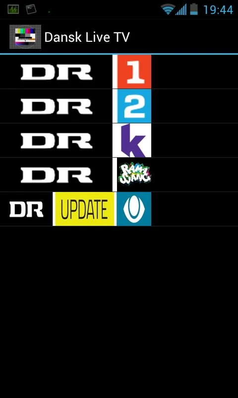

# Portfolio
The following is a small list of projects I developed.

[Bloatware Remover](#bloatware)

[Teletracker](#teletracker)

[SMS Wakeup](#smswakeup)

[Where Are you?](#whereareyou)

[Danish Live TV](#danishlivetv)

[Find A Water Tap](#findawatertap)

<a name="bloatware" />
=====================
### Bloatware Remover

This app lets you remove or freeze system apps.

This app is only released for beta testing. In order to test join [this](https://plus.google.com/communities/107237907630988713276) community at <http://plus.google.com>.

#### Features
* Delete system apps
* Freeze system apps
* Detect bloatware (comes with list of known bloatware)

**Keywords**: PackageManager, Root, AsyncTaskLoader

|
|

<a name="teletracker" />
===============
### Teletracker

People loose their phones all the time. Often by theft.

Imagine if each time a phone was sold, that the buyer would pay an extra $5 - $10 for the sales rep to install a piece of tracking software. I would like that software to be mine.

The problem with a project like this is, that unless you are an OEM, or the phone is rooted, you can eliminate the app by doing a factory reset.

However, when Samsung launched a similair project, I discontinued the development, because I felt it would be impossible to compete. Later on google also launched Device Manager. Yet both of these projects are still less featurefull and neither can handle a factory reset.

#### Features
* Locate phone
* Hide/unhide app from app drawer
* Various message commands
* Simcard verifier
* More

**Keywords**: RubyOnRails, REST, Postgresql, Android, GCM, Javascript, Google Maps, Sass, HAML and more.

|
|

<a name="smswakeup" />
==============
### SMS Wakeup

Small app designed to aid the heavy sleeper getting out of bed.

**Keywords**: SMS Broadcast Receiver, Custom Content Provider, Sqlite, CursorLoader

|
|

**Play**: https://play.google.com/store/apps/details?id=com.snot.smswakeup

**Github**: https://github.com/snot/SMS-Wakeup

<a name="whereareyou" />
==================
### Where Are You?

More people than you imagine are unable to share their own location with others. This app takes the reverse approach and let you request the location of someone else. It does so by sending an SMS containing a link for the receiver to click. When the user clicks the link, it is taken to a website which requests the location using Javascript and submits the location to a server sending it back to the app.

**Keywords**: Contact Provider, Custom Content Provider, CursorLoader, Google maps, AppEngine, GCM, Javascript, AJAX

|
|
|

**Play**: https://play.google.com/store/apps/details?id=com.snot.whereareyou

**Github**: https://github.com/snot/WhereAreYouApp

<!--
======================
### Where Are You? GAE
The backend for my "Where Are You?" app described above.

**Keywords**: AppEngine, GCM, Javascript, AJAX
-->

<a name="danishlivetv" />
==================
### Danish Live TV

Perhaps the simplest piece of software that I've ever written, but still the most successful and widely used.

By wrapping links to live streaming of Danish public service channels in a listview and presenting that as the sole content of an app, I got more than 60.000 downloads and more than 21.000 active users. At one point I was in the top five of most downloaded apps in the Danish app store.

However this apps life was short lived and abruptly ended by the laywers representing DR. I told them that they could have it for free. With source code and all. An offer for fun, becuase I saw a need. DR still hasn't made their own app.

|
|

<a name="findawatertap" />
=====================
### Find A Water Tap

This app lets you locate the nearest public place to get free drinkable water.

The backend of this app could quickly be replaced with something else. Which means it could be used to find the nearest anything.

This app is only released for beta testing. In order to test join [this](https://plus.google.com/communities/107237907630988713276) community.

The source will be released when I find time to clean it up.

**Keywords**: Custom Content Provider, SyncAdapter, Google Maps

|

